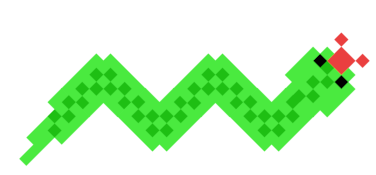
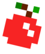
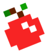

## **Snek (better snake)**

### Snek was my first java project for my java programing course in school. Some may say it seems ambitious but I think this is the best way for me to learn. I take on a big project and learn new stuff on the way.

### Snek is written entirely in java using the AWT canvas class. All sprites are made by me and I can proudly say that:

### **This code has been blessed by the absence of AI!**

    

## **Some stuff I learnt along the way**

- ### `Getting used to the syntax for statment like if, for and while`
- ### `Using arrays, storing and manipulating data in them`

## **I am still learning about**

- ### `Objects and classes`

### But I don't think it will be long befor I get used to them and how they work.
<pre>

                        

                                                            

    
</pre>
